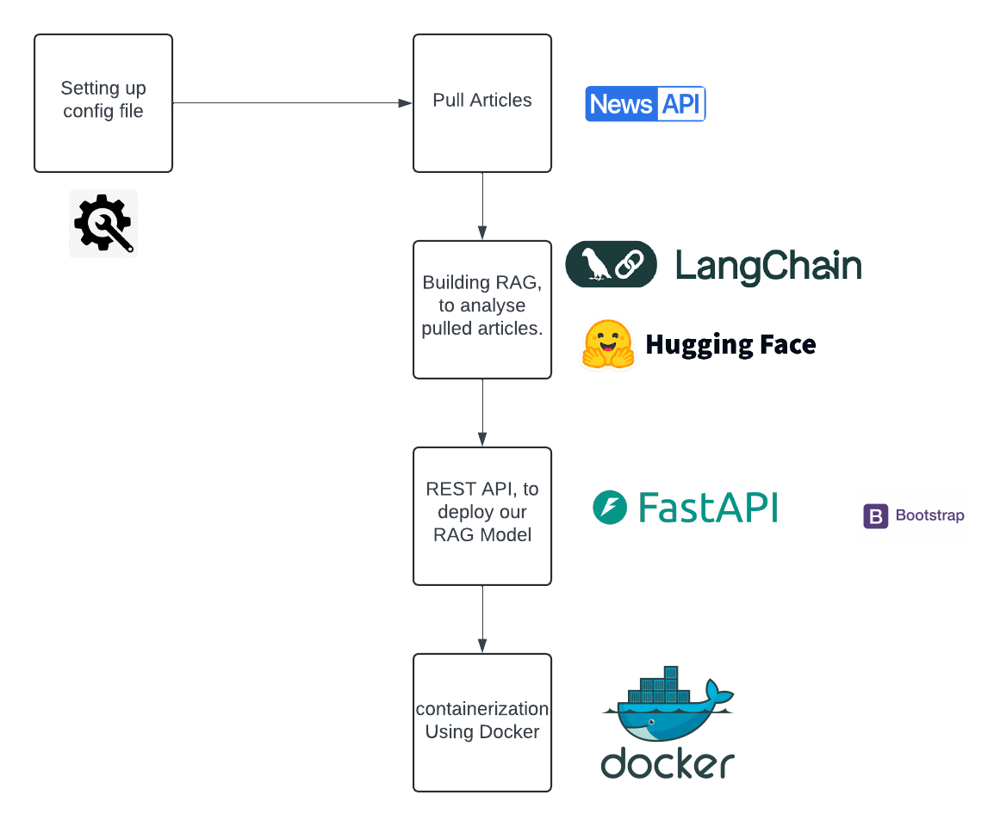
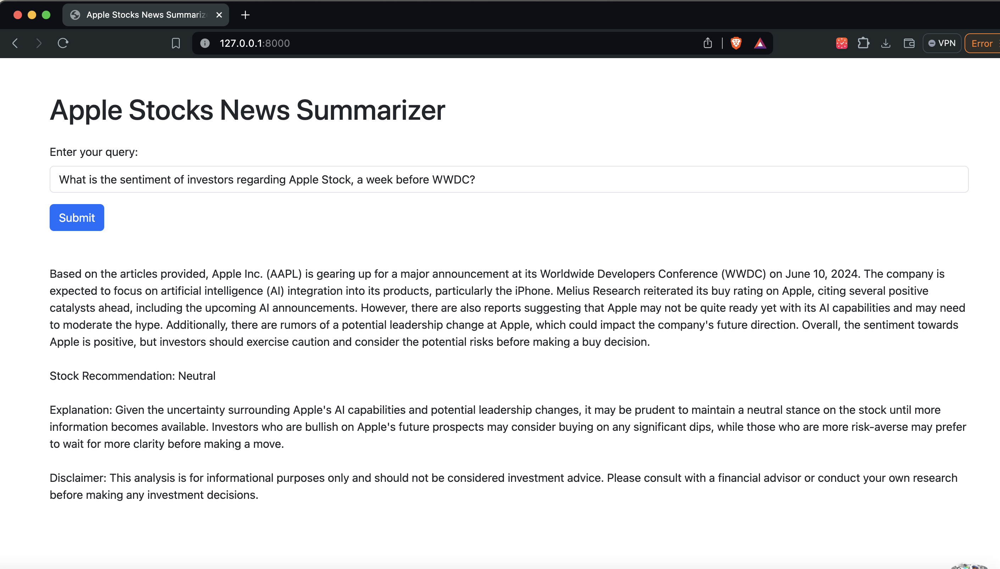

# README.md

# Adanced Rag - News Articles

This repository showcases a project that harnesses the power of LangChain to construct a Retrieval-Augmented Generation (RAG) model. The RAG model is designed to efficiently summarize and analyze articles based on any specified keyword. The project employs FastAPI to create an API, Docker for seamless containerization, and various other libraries for streamlined data processing and integration of the Large Language Model (LLM).

## Project Structure

- `summarize.py`: Contains the `LLMSummarizer` class, which handles the embedding model, document retrieval, and query processing.
- `main.py`: Sets up the FastAPI server and defines the API endpoints.
- `config.yaml`: Configuration file containing API keys, model configurations, and other parameters.
- `data_utils.py`: Contains a script to extract and preprocess data from the NewsAPI.
- `Dockerfile`: Docker configuration for containerizing the application.



## Installation

### Prerequisites

- Docker
- NewsAPI key
- HuggingFace API token

### Steps

1. Clone the repository:

```bash
git clone https://github.com/aymankhchman/Advanced-RAG-News-Articles.git
cd llm-summarizer
```

2. Create the necessary configuration file `config.yaml`:

```yaml
newsapi_key: your_newsapi_key
openai_key: your_openai_key
data: Apple WWDC_2024-06-04 01:02:29.445002.csv
repo_id: mistralai/Mistral-7B-Instruct-v0.2
keyword: Apple WWDC
sort_by: publishedAt
page: 20
embedding_model: all-MiniLM-L6-v2
llm_config:
  repo_id: mistralai/Mistral-7B-Instruct-v0.2
  max_new_tokens: 2048
  max_length: 512
  temperature: 0.001
huggingfacehub_api_token: your_huggingfacehub_api_token
template: '''
Use the following articles to provide a comprehensive analysis of {keyword}, including overall sentiment and stock recommendation. Please ensure your analysis is thorough and the recommendation is clear.

Articles:
{context}

Question: Based on the articles provided, what is the overall analysis of {keyword}? Include the sentiment (positive, negative, neutral) and a stock recommendation (strong buy, buy, neutral, sell).

Helpful Answer:
'''
```

## Model Configuration

You can choose any available embedding model or LLM such as Llama 3 on Hugging Face, OpenAI, or Mistral-7B. In this project, we have chosen to use Mistral-7B for demonstration purposes. You can configure this in the `config.yaml` file.

Example configuration:

```yaml
embedding_model: all-MiniLM-L6-v2
llm_config:
  repo_id: mistralai/Mistral-7B-Instruct-v0.2
  max_new_tokens: 2048
  max_length: 512
  temperature: 0.001
huggingfacehub_api_token: your_huggingfacehub_api_token
```

3. Build and run the Docker container:

```bash
docker build -t llm-summarizer .
docker run -p 80:80 llm-summarizer
```

## Usage

### API Endpoints

- **GET /**: Returns a simple message.
- **POST /query**: Accepts a JSON payload with a query and returns a summary and analysis.

Example:

```json
{
  "query": "What is the overall analysis of the latest articles on climate change?"
}
```

Response:

```json
{
  "answer": "The overall analysis based on the articles provided is..."
}
```

Or using the interface:




### Data Extraction

To extract and preprocess data from the NewsAPI based on a specified keyword, run:

```bash
python data_utils.py
```

This will save the preprocessed data as a CSV file in the `data` directory.


## Acknowledgements

- [LangChain](https://github.com/langchain/langchain)
- [HuggingFace](https://huggingface.co/)
- [NewsAPI](https://newsapi.org/)

## Contributing

Contributions are welcome! Please open an issue or submit a pull request for any features, bug fixes, or enhancements.

---

This README provides a comprehensive guide to setting up and using the LLM-based Summarizer project. If you have any questions, feel free to open an issue on the repository.
